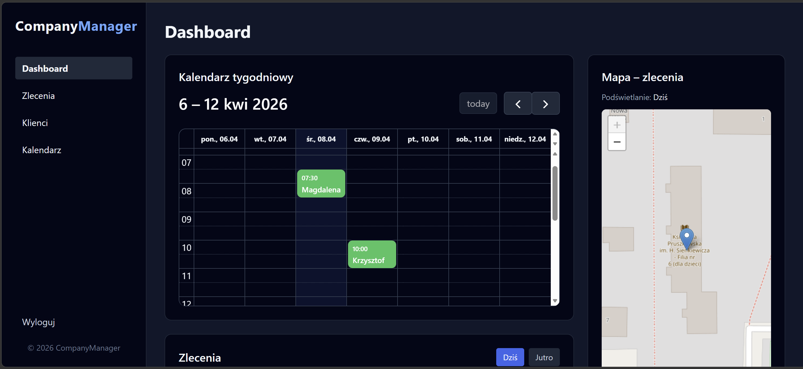
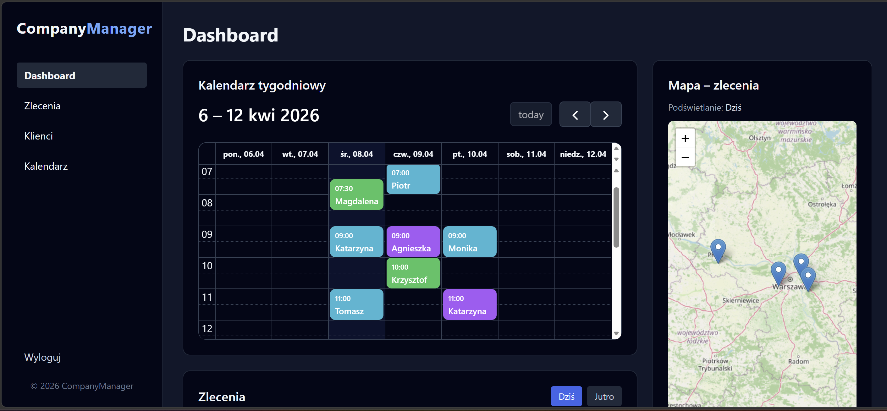

# CompanyManager

CompanyManager is a full-stack Django web application designed for managing employees, service orders, and client relationships in a real-world business environment.

The system is actively being developed and continuously improved, with a strong focus on usability, scalability, and real business needs.


## Project Overview

This application helps service-based teams:

- organize daily work,
- assign tasks to employees,
- manage client data,
- visualize work in calendar and map views.

The project reflects real business workflows and includes role-based access and responsive UI.


## Key Features

### Authentication & Roles
- Secure login system (Django Auth)
- Role-based access control:
  - **Admin (Manager)** – full system access
  - **Employee** – access only to assigned orders


### Order Management
- Create, edit, and delete orders
- Assign orders to employees
- Track status and payment
- Filter by order status


### Client Management
- Full client database
- Contact details (phone, address, city)
- Notes and service history
- Search and sorting functionality


### Calendar Integration
- Weekly and monthly views (FullCalendar)
- Clickable events linked to order details
- Overview of workload


### Map Integration
- Interactive map (Leaflet + OpenStreetMap)
- Displays order locations
- Helps visualize daily work distribution


### Dashboard
- Overview of current workload
- Quick access to today's and tomorrow's orders
- Map preview of active locations


### Responsive UI
- Optimized for:
  - desktop
  - tablet
  - mobile
- Mobile-friendly navigation and simplified views


## Tech Stack

- **Backend:** Django (Python)
- **Frontend:** Django Templates + Tailwind CSS
- **Database:** SQLite
- **Calendar:** FullCalendar
- **Maps:** Leaflet + OpenStreetMap
- **Authentication:** Django Auth


## Demo

<p align="center">
  
</p>


## Role-Based UI Comparison

The system provides different interfaces depending on user role:

| Feature            | Admin (Manager) | Employee |
|------------------|----------------|----------|
| View all orders   | ✅              | ❌       |
| Manage clients    | ✅              | Limited  |
| Edit all data     | ✅              | ❌       |
| Own orders only   | ❌              | ✅       |


### Employee's dashboard

 

### Admin's dashboard



## Architecture Highlights

- Role-based data filtering (security-first approach)
- Separation of concerns (views, models, templates)
- Modular and scalable structure
- Responsive UI with adaptive layouts
- Integration with external libraries (maps & calendar)


## Project Status

**Actively developed**

This project is continuously improved and extended with new features and optimizations.


## Planned Improvements

### Functionality
- Route optimization between orders
- Email / SMS notifications
- Advanced filtering and analytics
- Order history tracking improvements
- File attachments (photos, documents)

### UX/UI
- Customizable dashboard
- Dark/light mode switch
- Improved mobile experience
- Better navigation for large datasets

### Technical
- PostgreSQL support
- Docker deployment
- API (REST) for integration
- Automated testing (unit & integration)
- Performance optimization


## Getting Started

Clone the repository:

```bash
git clone https://github.com/julialuza/company-manager-django.git
cd company-manager-django
```
Create virtual environment
```bash
python -m venv venv
venv\Scripts\activate
```
Install dependencies
```bash
pip install -r requirements.txt
```
Run migrations
```bash
python manage.py migrate
```
Create admin user
```bash
python manage.py createsuperuser
```
Run the server
```bash
python manage.py runserver
```
